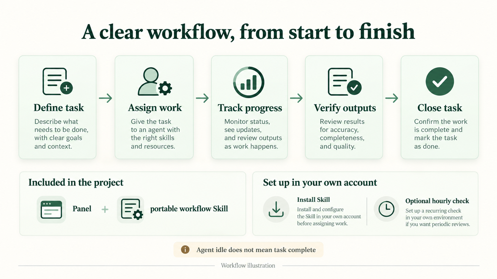

# dots panel

**把任务进度、执行者状态与交付文件，放回同一个工作现场。**

一个轻量、私有、可自行安装的本地工作面板。支持原生桌面与可选 Web 视图，使用 Python 标准库，不依赖 npm、Docker 或云数据库。


*设计示意 / 示例数据，非实时截图。*

Python 3.10+ · SQLite · Tkinter · 中文 / English · MIT

[快速开始](#快速开始) · [配套工作流 Skill](#配套工作流-skill) · [安装指南](docs/install.md) · [任务接入](docs/task-integration.md) · [隐私边界](docs/privacy.md)

## 为什么做这个面板

任务讨论完了，工作未必做完；执行者待命了，项目也未必结束。dots panel 把这些事实分开记录：

- **一个目标，一项活动**：规划、实现、测试、审查、交付放在同一时间线，继续工作时沿用原活动
- **状态有证据**：任务生命周期、执行者最近观察状态、阶段验证结果分别显示，不用陈旧心跳猜测完成
- **成果有归档**：每个任务有固定的 inputs / outputs / tmp；正式输出显式登记，保存大小与内容校验值
- **数据留在本地**：源代码和私有 DATA 分离，不自动读取聊天、导入账户资料或上传任务
- **工作流可携带**：随仓库附带通用任务管理 Skill 源码，供接收者在自己的账户中另行安装

它是主动登记的工作记录，不是自动执行器，也不会把面板卡片冒充真实平台会话。

## 七个页面，各有分工


*设计示意 / 示例数据，非实时截图。*

| 页面 | 能看到什么 |
| --- | --- |
| 总览 | 当前环境可见资源、任务生命周期筛选、近期工作 |
| 活动 | 任务列表、阶段时间线、沟通摘要与已登记文件 |
| Agent | 主动登记的执行者、最近观察、活动关联与当前工作类型 |
| 定时任务 | 计划元数据与显式外部结果快照；结果接入不等于平台调度已核验 |
| 软件 | 白名单软件检测与显式登记；检测到不等于正在运行 |
| 规则 | 双语项目规范、程序校验 / 工作约定 / 规划功能，以及用户 Skill 元数据 |
| 关于与版本 | 本地版本和人工核验的发布信息；不自动联网或更新 |

外部结果可通过受控 `schedule-result-import` 导入最近观察、结果来源与历史索引；失败保留上次成功快照，平台任务配置保持单独未核验。不会联网轮询或改变平台定时任务。详见 [结果接入与重装边界](docs/task-integration.md#external-result-snapshots-read-only)。

原生与 Web 界面均支持 Auto / 中文 / English。界面翻译不改写任务原文；每 5 秒刷新的是本地数据，不是平台实时状态。

## 快速开始

要求 Python 3.10+。默认桌面视图还需要已可用的 Tkinter 与图形桌面；缺少时先核对环境，不会自动安装依赖。

下载仓库后，在**你选定的实际桌面终端**中设置两个独立目录。以下路径只是占位符：

```sh
SOURCE=/absolute/path/to/dots-panel
DATA=/absolute/path/to/dots-panel-data
cd "$SOURCE"

# 先验证源码
PYTHONPATH=src python3 -m unittest discover -s tests -v

# 安装桌面入口，再打开原生面板
sh "$SOURCE/scripts/install-desktop.sh" --data-dir "$DATA"
python3 "$SOURCE/scripts/desktop.py" open --data-dir "$DATA"
```

安装器初始化私有数据目录，创建应用快捷方式；已有 Desktop 目录时另放桌面副本。它不创建自启动服务、不修改网络或安全配置。原生视图直接只读 SQLite，无需 HTTP 服务。

shell 与桌面可能不在同一个环境。安装后须在目标桌面实际打开，并验证快捷方式能再次打开；命令成功不等于窗口已显示。完整排错见 [安装与交接](docs/install.md)。

### 可选：同机 Web 视图

```sh
sh "$SOURCE/scripts/start.sh" --data-dir "$DATA" serve --port 8765
```

从**同一台机器**的浏览器打开 `http://127.0.0.1:8765`。只监听 IPv4 loopback，没有远程写接口。平台若拒绝本地访问，不要用隧道、公开端口或安全配置变更绕过。

## 配套工作流 Skill

仓库附带一个用户编写、经清理的可移植工作流：
[manage-development-activities](skills/manage-development-activities/SKILL.md)。

它指导使用者复用活动与经验证的会话身份、记录真实状态、归档成果，并按同一份 [收尾清单](skills/manage-development-activities/references/closeout.md) 完成检查。该目录是唯一维护源，导出包按需生成。

```sh
# 校验随附源码，查看组件状态
python3 "$SOURCE/scripts/workflow-skill.py"

# 导出到源码目录外的新 ZIP 文件，不覆盖已有文件
python3 "$SOURCE/scripts/workflow-skill.py" --export /absolute/path/to/new-workflow-skill.zip
```

**随附源码 ≠ 账户安装 ≠ 当前会话已加载。**

- 独立检查脚本与 doctor 校验 Skill 源码，但不会将它安装到账户、注册为已安装或声明已触发
- 接收者须使用自己账户中当前受支持的 Skill 安装 / 导入入口，并验证安装结果与会话可用性
- 更新仓库不会自动覆盖账户里的 Skill；面板 `skill-upsert` 只保存展示元数据
- 可选每小时检查需接收者另行授权、配置并验收；安装器不会创建自动化，计划登记也不是定时器
- 不附带作者的账户标识、管理链接、自动化或内部 / 平台 Skill；X 阅读器独立，不随本项目打包

详见 [Skill 安装与验收](docs/workflow-skill.md)。若目标产品没有受支持的安装入口，保留“源码可用、账户安装未核验”，不要伪装已完成。

## 从任务到交付



*设计示意 / 示例数据，非实时截图。*

下面只演示显式 CLI 记录。请在独立测试 DATA 中试跑，不要把示例写入正式任务库：

```sh
panel() { sh "$SOURCE/scripts/start.sh" --data-dir "$DATA" "$@"; }
panel register example-check --name '示例检查' --project '示例项目'
RUN=$(panel start example-check --note '开始已授权的检查')
panel log "$RUN" '检查输入完成'
# 新运行须先记录真实验证与交付依据，再通过完成门槛
# 使用 closeout-record 的返回 record_id；不要把示例检查当成实际验证
panel closeout-record "$RUN" --summary '实际完成的产出' --scope '实际检查范围' --verification passed --evidence '实际检查结果' --limits '尚未检查的部分' --no-artifact-reason '本次任务确实无需交付文件的理由'
panel closeout "$RUN" --record '上一步返回的-record_id'
panel status
```

三种身份始终区分：

1. **活动**：稳定任务编号与工作时间线
2. **执行者**：面板资料与最近一次显式观察；昵称不是会话编号
3. **真实会话**：仅绑定受支持平台工具实际返回并核验的身份；没有就保持未绑定

执行者 idle 不代表任务 succeeded。等待用户、批准、外部结果或连接恢复时，记录等待原因与下一步；支持 waiting_user、waiting_external、paused、awaiting_review 状态；用 transition 显式登记原因、依据和下一步。旧记录只表示状态待确认，不自动判定失败或重跑。

更多示例：[阶段、会话与文件接入](docs/task-integration.md)。

## 完成门槛与只读自检

新运行使用 closeout-record / closeout 记录验证范围、依据、限制与交付文件；归档、发送、打开和用户验收是不同事实。没有证据不显示为已完成。

`panel doctor` 只读检查本机目录、权限、结构和配套 Skill 文件；账户安装、定时器配置和实际执行需要各自的人工观察，8/8 本机检查不等于账户已配置。总览单独展示需要处理与等待外部结果的任务。

## 私有数据与目录

```text
SOURCE/                         公开源码
  src/dots_panel/                CLI、数据库与原生界面
  web/                          静态 Web 界面
  skills/manage-development-activities/
  scripts/  tests/  docs/

DATA/                           独立私有目录，不提交 Git
  db/                           SQLite 记录
  config/  logs/  run/           本地配置与运行信息
  tasks/<task-id>/
    inputs/  outputs/  tmp/      单一任务的资料与成果
```

运行目录按 0700、数据库按 0600 创建；拒绝不安全的既存权限或符号链接，交由所有者核对。不把真实 DATA、截图、日志、账户链接或聊天记录打包发布。

无遥测、CDN、外部字体或默认外网请求；不扫描其他项目、浏览器或账户历史。仅使用主动登记、经过筛选的摘要。公开发布前仍要检查完整文件清单，不能只依赖 `.gitignore`。

## 目前的边界

- 无自动聊天同步、全局文件监听、账户 Skill 扫描或后台调度执行器
- 会话绑定与最后观察不证明连接仍在线；监控接入要单独验证
- 可见 CPU / 内存 / 磁盘不等于账户额度；不可读的配额显示未知
- Web 文件页只显示元数据；原生只支持受限 PNG / 纯文本预览，归档不等于用户已收到下载
- 不提供远程认证访问、通用软件安装 / 卸载、任意进程控制或自动更新
- 云电脑是否持久在线由宿主平台决定，本项目不能保证自动唤醒或重启后持续运行

## 开发与验证

```sh
PYTHONPATH=src python3 -m unittest discover -s tests -v

# 可选：已安装 Node.js 时检查 Web 逻辑；应用运行不依赖 Node.js
node --check web/app.js
node tests/test_web_locale.js
node tests/test_workspace.js
node tests/test_skills_web.js
node tests/test_attention_web.js
node tests/test_status_filters_web.js
node tests/test_recovery_render_web.js
```

测试使用合成数据与临时目录，覆盖数据边界、活动与绑定、文件归档、界面逻辑及 Skill 导出 / 安装状态。自动化测试不替代目标桌面视觉验收、真实账户 Skill 安装或首次定时执行验证。

修改前阅读 [AGENTS.md](AGENTS.md)，保留已有源代码变更。发布、文件分享、账户操作和删除数据须遵循使用者授权。

## 文档与许可

- [安装、升级与排错](docs/install.md)
- [任务与文件接入](docs/task-integration.md)
- [配套 Skill 安装](docs/workflow-skill.md)
- [项目规则维护](docs/rules.md)
- [架构](docs/architecture.md) · [隐私与边界](docs/privacy.md)
- [MIT License](LICENSE)
