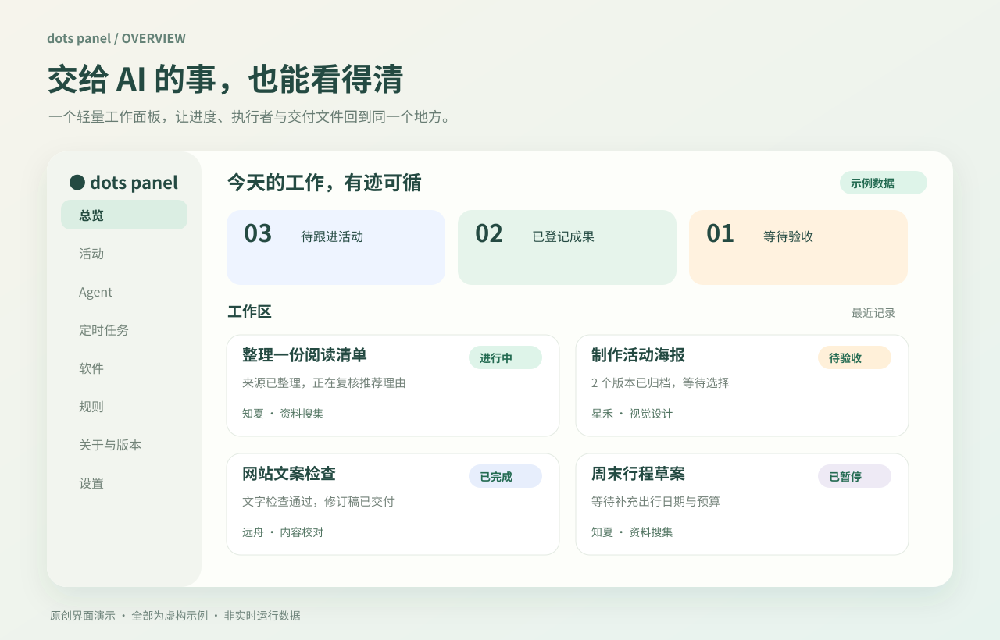
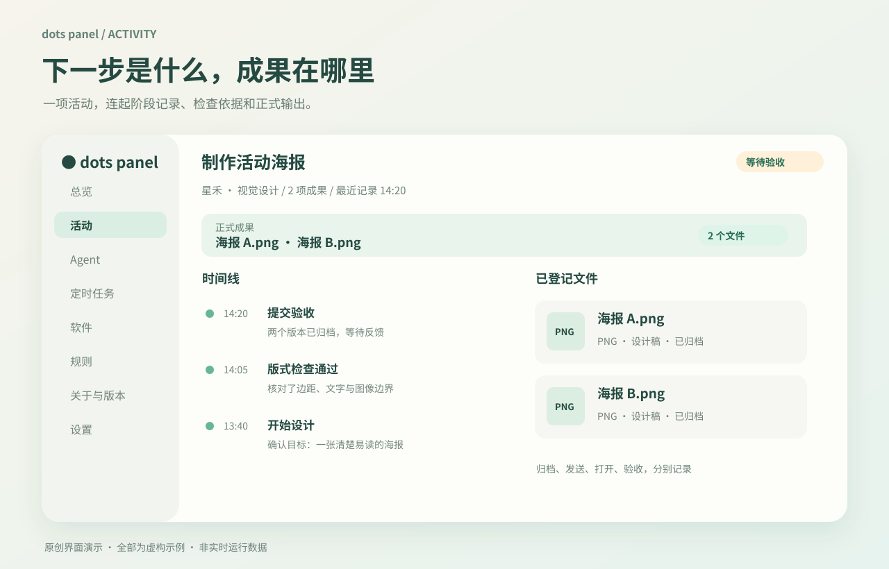
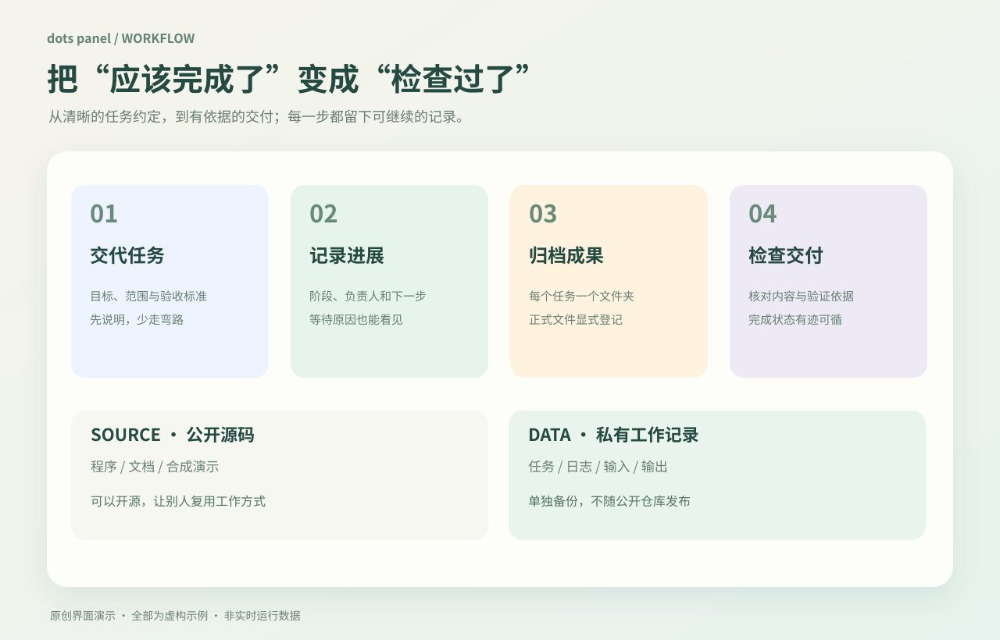

# dots panel · OpenAI dot 云电脑辅助面板

**为 OpenAI dot 云电脑打造的开源辅助面板，让任务进度与成果看得见。**

任务做到哪了？谁在处理？最后的文件在哪？

dots panel 把分散的任务进度、执行者观察和成果文件，整理成一个轻量、私有、可自行安装的工作面板。少翻记录，少猜状态，下一次继续工作时知道从哪里接上。

面向使用 **OpenAI dot / ChatGPT**，在 dot 云电脑上持续做开发、研究和内容制作的人。dots-panel 是独立的第三方开源辅助工具，**不是 OpenAI 官方产品，也未获 OpenAI 背书**；数据由执行者通过 CLI 或配套 Skill 工作流程主动登记。

An open-source, third-party task dashboard for **OpenAI dot’s cloud computer in ChatGPT**. Keep registered tasks, agent observations, progress and output files together. Lightweight Python + SQLite, with desktop and optional local web views. Unofficial community project.

**Python 3.10+ · 标准库 · SQLite · 原生桌面 / 可选 Web · 中文 / English · MIT**

无需 npm、Docker 或云数据库。原生视图直接读取本地记录；你的工作数据与公开源码分开保存。

[快速开始](#快速开始) · [看一个任务](#看一个任务) · [功能与边界](#功能与边界) · [安装文档](docs/install.md) · [隐私说明](docs/privacy.md)


*原创界面示意 / 合成数据，非实时截图。*

## OpenAI dot 是什么？

**dot 是 OpenAI 在 ChatGPT 中提供的持续型 AI 助手**：它拥有自己的云电脑，可以围绕你交代的目标推进工作，并在你的授权范围内使用连接的应用。访问你的本地电脑是另行连接与授权的能力，不等于打开这个面板就能控制本机。具体可用性以账户和平台当前支持情况为准。

- [OpenAI 官方：开始使用你的 dot](https://help.openai.com/en/articles/20001530-getting-started-with-your-dot)
- [OpenAI 官方：连接电脑和应用](https://learn.chatgpt.com/docs/dots/computers-and-apps)

**dots-panel 为这个云电脑工作场景补充一层可检查的工作台。** 它把主动登记的活动、Agent 观察、阶段进展、成果文件和定时结果快照整理到一起，帮助你回答“做到哪了、接下来做什么、交付物在哪里”。

安装 dots-panel 不会创建 dot、开通 ChatGPT 权益或替代平台原有的任务与权限系统；使用者需要先有可用的 dot 环境。

## 它解决什么问题？

当你同时让 AI 查资料、写代码、做设计，真正费心的往往是跟进：

- 目前做到哪一步，还有什么在等待？
- 执行者最近一次观察是什么时候？
- 哪个文件是正式成果？存在哪一项任务下？
- 已验证的部分和还没核验的部分，分别是什么？

dots panel 把这些信息放在同一项活动里。执行者通过本机 CLI 主动登记经过筛选的摘要，面板负责展示记录。

它是独立自定义项目，不是 dot 官方功能页。它不会自动执行任务、同步全部聊天或扫描其他项目。

## 三种常见用法

- **继续一个没做完的任务**：沿用同一项活动，找到等待原因与下一步
- **检查交付文件**：核对 outputs 中的版本、检查依据与交付记录
- **核对定时结果**：一起查看已导入的平台观察与结果快照，再确认实际运行情况

## 看一个任务

同一个目标沿用一项活动：

**需求 → 制作 → 检查 → 交付**


*原创界面示意 / 合成数据，非实时截图。*

1. 在总览找到任务，再到活动页查看阶段与摘要
2. 看“完成了什么、等待什么、下一步是什么”，而不只看状态灯
3. 在该任务的文件列表确认正式输出
4. 把检查范围、依据与限制写入收尾记录

执行者待命不代表任务完成。文件已归档、已发送、用户已打开和已验收，也是不同事实。

## 八个页面

| 页面 | 主要用途 |
| --- | --- |
| 总览 | 任务生命周期、近期工作、当前环境可见资源 |
| 活动 | 阶段时间线、工作摘要、登记文件 |
| Agent | 执行者最近观察、任务关联与当前工作类型 |
| 定时任务 | 已登记计划、平台状态的显式观察与外部结果快照 |
| 软件 | 白名单可用性检测与显式登记 |
| 规则 | 项目规范与用户 Skill 展示元数据 |
| 关于与版本 | 本地版本与人工核验的发布信息 |
| 设置 | Auto / 中文 / English、显示时区 |

界面默认每 5 秒读取本地记录，不会因此实时连接平台。显示时区默认 Asia/Shanghai；更改显示时区不会修改原始时间戳、系统时间或平台计划。原生与 Web 偏好分别保存。

## 快速开始

要求 Python 3.10+。原生视图还需要已可用的 Tkinter 和图形桌面；安装器不会自动补装依赖。

在你选定的实际桌面终端中，设置两个独立目录：

```sh
SOURCE=/absolute/path/to/dots-panel
DATA=/absolute/path/to/dots-panel-data

cd "$SOURCE"
PYTHONPATH=src python3 -m unittest discover -s tests -v
sh "$SOURCE/scripts/install-desktop.sh" --data-dir "$DATA"
python3 "$SOURCE/scripts/desktop.py" open --data-dir "$DATA"
```

源码与私有 DATA 不要放在同一目录内。shell 与桌面可能不在同一个环境；安装后应在目标桌面实际打开，并检查快捷方式能再次打开。

原生面板直接只读 SQLite，不需要 HTTP 服务，也不创建自启动服务。

### 可选：同机 Web 视图

```sh
sh "$SOURCE/scripts/start.sh" --data-dir "$DATA" serve --port 8765
```

从同一台机器访问 http://127.0.0.1:8765。服务只监听 IPv4 loopback，没有远程写接口。平台明确拒绝本地访问时，不用隧道或公开端口绕过。

更多安装、升级、字体和桌面问题，见 [安装文档](docs/install.md)。

## 文件放在哪里？

```text
SOURCE/                         可公开的项目源码
DATA/                           独立私有数据，不提交 Git
  db/                           SQLite 记录
  config/  logs/  run/           配置与运行信息
  tasks/<task-id>/
    inputs/                     输入资料
    outputs/                    显式登记的成果
    tmp/                        草稿与临时文件
```


*原创流程图，说明项目的登记与交付方式。*

成果登记会保存大小和内容校验值，保留旧版。面板不会自动归档任意工具产生的所有文件。

原生界面支持受限 PNG / 纯文本预览，以及打开经过验证的任务输出目录。Web 文件页仅展示元数据；面板登记不等于用户已经收到可下载的附件。

## 配套工作流 Skill

仓库附带 [manage-development-activities](skills/manage-development-activities/SKILL.md) 的可移植源码，用于指导复用活动、记录真实状态和归档成果。

```sh
python3 "$SOURCE/scripts/workflow-skill.py"
python3 "$SOURCE/scripts/workflow-skill.py" --export /absolute/path/to/new-workflow-skill.zip
```

**源码可用、账户安装、会话加载是三件事。** 接收者需使用自己账户中受支持的入口安装并核验。面板中的 Skill 清单只登记展示信息，不安装、更新或启用 Skill。

工作约定需要执行者遵循，不是操作系统全局强制机制。见 [Skill 安装与验收](docs/workflow-skill.md) 和 [规则说明](docs/rules.md)。

## 定时任务与恢复

定时任务页展示显式导入的官方平台观察和外部结果快照。它不会创建、暂停、恢复或轮询平台定时器。

- 本地记录、平台计划配置和实际执行结果分别核验
- 下一次执行未由官方读取得到时，保持未知
- 手动试跑或一次结果文件，不证明首次定时执行成功
- 新的外部读取与显式导入，才会带来更新的观察

备份需另行执行并核验。保留独立私有 DATA，包括一致性的 SQLite 备份；不要把数据库、日志、真实任务、账户链接和工作截图混入公开源码。

恢复 DATA 只恢复记录、关联和观察快照，不会新建或复制平台任务。恢复后应重新核对平台当前状态。云电脑及文件生命周期由宿主平台决定，本项目不保证永久保存、自动唤醒或重启后持续运行。

详见 [任务接入与恢复边界](docs/task-integration.md#external-result-snapshots-read-only)。

## 功能与边界

- 无默认外网请求、遥测、CDN 或外部字体
- 不自动读取聊天、账户历史或其他项目
- 无后台调度执行器、通用软件安装卸载或任意进程控制
- 最近观察不证明执行者此刻仍在线
- CPU / 内存 / 磁盘不代表账户额度；不确定的数据保持未知
- 项目规范与 Skill 不改变账户权限或平台安全要求

默认运行目录按 0700、数据库按 0600 创建；拒绝不安全的既存权限或符号链接。完整说明见 [隐私边界](docs/privacy.md)。

## 开发与验证

修改前阅读 [AGENTS.md](AGENTS.md)。保留现有改动，测试和示例使用隔离的合成 DATA。

```sh
PYTHONPATH=src python3 -m unittest discover -s tests -v
```

如环境已有 Node.js，可进一步执行项目现有 Web 验证脚本。实际应用不依赖 Node.js。

自动化测试不代替目标桌面验收、账户 Skill 安装检查或首次定时执行核验。

[架构](docs/architecture.md) · [任务接入](docs/task-integration.md) · [MIT License](LICENSE)
